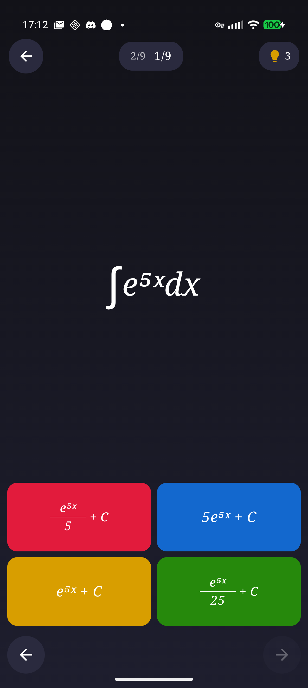
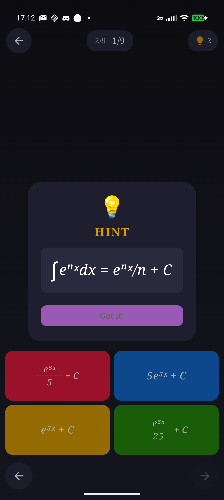
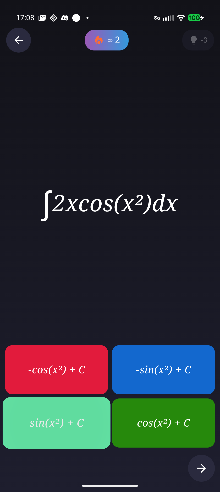
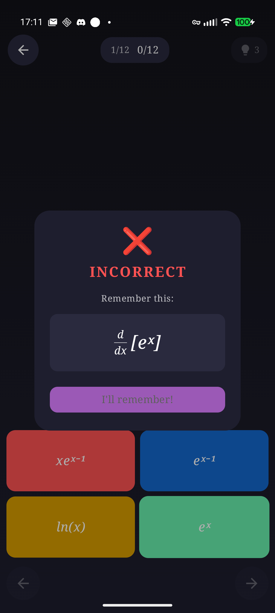

#  3 Quick Maths

A lightweight Android app for practicing derivatives and integrals (mainly trig). Think Kahoot or Duolingo but faster, lighter and without the corporate bloat feel.

## Why I Made This

I needed practice for my ODE class but couldn't find any good resources online. Every mobile app I tried was slow, bloated with tokens and currencies, and constantly hit me with subscription popups. So I built my own - no ads, no accounts, no BS. Just math practice.

## Features

- **Practice Mode** - Work through topic groups with best score tracking
- **Infinity Mode** - Endless random questions with streak counter
- **Haptic & Sound Feedback** - Vibrations and audio cues for answers
- **Progress Persistence** - Scores saved locally

## Screenshots

| Menu | Question | Hint |
|:---:|:---:|:---:|
|  |  |  |

| Correct Answer | Wrong Answer |
|:---:|:---:|
|  |  |

## Topics Covered

**Derivatives:** Basic Trig, Inverse Trig, Hyperbolic, Exponential & Log, Power Rule

**Integrals:** Basic Trig, Inverse Trig Results, Hyperbolic, Exponential & Log, Power Rule, U-Sub, Integration by Parts, Trig Powers

## Known Issues

- Wrong answer sound may feel delayed
- Hints are sometimes useless and other times make no sense
- Small topic pool / limited question variety
- Formula text may get cut off when you get the wrong answer popup

## Requirements

- Android 10+ (API 29)
- ARM64 device
- Unsigned APK - may need to enable "Install from unknown sources"

## Technical Highlights

- **Kotlin** with modern coroutines and Flow
- **Jetpack Compose** declarative UI with custom theming
- **MVVM Architecture** using ViewModel and state hoisting
- **Material Design 3** with dynamic color support
- **SoundPool** for low-latency audio feedback
- **SharedPreferences** for lightweight local persistence
- **R8 optimization** with ProGuard for release builds
- **Adaptive haptics** using Android's VibrationEffect API

## Installation

Download the latest APK from [Releases](https://github.com/poninka/3quickmaths/releases) and install it on your device.

Alternatively, build it yourself:

```
git clone https://github.com/poninka/3quickmaths.git
```

Open in Android Studio. Build. Run.

## License

This project is licensed under the **GNU Affero General Public License v3.0 (AGPL-3.0)**.

**Personal & Non-Commercial Use:** This software is free for personal and non-commercial internal use.

**Commercial Use:** Any commercial use, redistribution, or resale requires a separate commercial license from the author. Contact the author for licensing inquiries.

See the [LICENSE](LICENSE) file for full license text.
